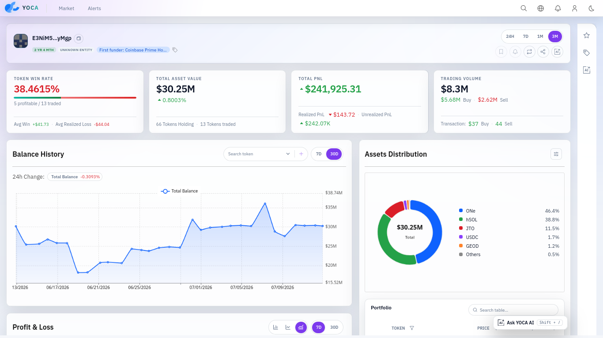
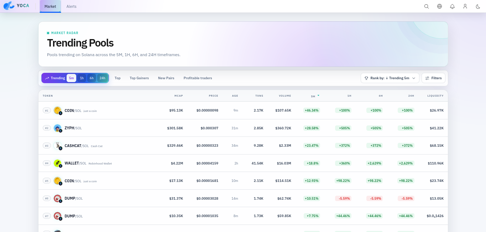
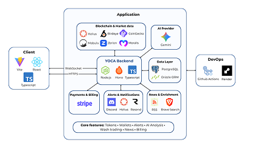

<div align="center">
  

  # YOCA

  **Yet another On-chain Analysis**

  *From market signals to token, wallet, and on-chain behavior analysis.*

  A full-stack analytics platform for exploring Solana markets, investigating
  wallets, detecting suspicious trading patterns, and turning fragmented
  blockchain data into understandable insights.

  
  
  
  
  
</div>

<br />



## Overview

**YOCA** stands for **Y**et another **O**n-**C**hain **A**nalysis. It is a
web platform built to make fragmented blockchain and market data easier to
explore, connect, and interpret.

Blockchain users often have to move between several explorers, market
dashboards, and data providers to understand a token or wallet. Yoca brings
those workflows into one application. A user can discover market activity,
inspect a token or liquidity pool, continue into wallet performance, and use
AI-assisted explanations without losing context between pages.

The backend normalizes data from multiple providers into PostgreSQL and reuses
fresh records before requesting external APIs. This database-first approach
keeps provider usage observable while giving the client a consistent,
type-safe API contract.

## Product highlights

| Area | What Yoca provides |
| --- | --- |
| **Market Radar** | Trending pools, gainers, new pairs, profitable traders, and multi-window market signals. |
| **Token & Pool Analytics** | Price, liquidity, holders, tokenomics, news context, volatility summaries, and AI-assisted research. |
| **Wallet Analytics** | Portfolio value, balance history, realized and unrealized PnL, swaps, transfers, counterparties, and wallet activity. |
| **Alerts** | Wallet monitoring rules with alert history and email or Discord delivery. |
| **Wash Trading Detection** | Transaction-graph analysis, risk scoring, detection logs, and explainable behavioral signals. |
| **Contextual AI** | Token research, wallet chat, chart explanations, and wash-trading interpretation grounded in application data. |

<table>
  <tr>
    <td width="50%">
      
    </td>
    <td width="50%">
      
    </td>
  </tr>
  <tr>
    <td align="center"><strong>Market Radar</strong></td>
    <td align="center"><strong>Wash Trading Analysis</strong></td>
  </tr>
</table>

## Architecture



Yoca is an npm-workspace monorepo. The React client consumes a Hono API, while
server services validate provider responses with Zod, store structured data
through Drizzle, and expose Prometheus metrics for operational analysis.

## Technology

| Layer | Main technologies |
| --- | --- |
| Client | React 19, Vite 7, TypeScript, Carbon Design System, SWR, ECharts |
| Server | Hono 4, Node.js, Zod, Hono RPC |
| Data | PostgreSQL, Drizzle ORM |
| Blockchain | Solana Kit, Helius, CoinGecko, Birdeye, Mobula, Zerion, Moralis |
| AI & search | Google Gemini, Brave Search |
| Delivery & payment | Resend, Discord webhooks, Stripe |
| Operations | GitHub Actions, Render, Supabase, Prometheus, Grafana |

## Getting started

### Prerequisites

- Node.js 22
- npm 11
- A PostgreSQL database
- Provider credentials for the modules you want to run
- Docker and Docker Compose only when using the observability stack

### 1. Install dependencies

```bash
git clone https://github.com/hongphuchcmus/Yoca.git
cd Yoca
npm install
```

The root workspace installs dependencies for both `client` and `server`.
Optional native dependencies must remain enabled because Vite and esbuild
select binaries for the current operating system.

### 2. Configure the environment

```bash
cp server/.env.example server/.env
cp client/.env.example client/.env
```

Set `POSTGRES_DB_URL`, the client API domain, authentication secrets, and the
provider keys required by the features being developed. Keep real credentials
out of version control.

The default local addresses are:

| Service | Address |
| --- | --- |
| Client | `http://localhost:3000` |
| Server | `http://localhost:4000` |
| Metrics | `http://localhost:4000/metrics` |

### 3. Prepare the database

For a new or disposable development database:

```bash
npm run db:push
```

To inspect the schema and records:

```bash
npm run db:studio
```

`npm run db:reset` clears the selected database before recreating the schema.
Use it only with a disposable development database.

### 4. Start the application

Run both workspaces:

```bash
npm run dev
```

Or run them in separate terminals:

```bash
npm run server:dev
npm run client:dev
```

## Production build

Build both workspaces:

```bash
npm run build
```

The client produces static assets in `client/build`; the server produces
Node.js output in `server/build`.

Preview the complete production build:

```bash
npm run preview
```

Individual workspace commands are also available:

```bash
npm run client:build
npm run client:preview

npm run server:build
npm run server:preview
```

## Webhook development

Wallet alerts use a public callback URL for Helius delivery. After configuring
`HELIUS_API_KEY`, `HELIUS_WEBHOOK_AUTH_KEY`, `NGROK_AUTHTOKEN`, and
`NGROK_DOMAIN`, start the server, tunnel, webhook synchronization, and client
with:

```bash
npm run dev:webhook
```

The webhook development script is designed to work on Linux and Windows.

## Observability

Start Prometheus and Grafana locally:

```bash
npm run observability:up
```

Useful companion commands:

```bash
npm run observability:logs
npm run observability:config
npm run observability:down
```

The stack scrapes server metrics for inbound requests, provider calls,
latency, status codes, and service-declared data usage. It is optional for
normal feature development.

## Development commands

| Command | Purpose |
| --- | --- |
| `npm run dev` | Start client and server in development mode |
| `npm run build` | Build all workspaces |
| `npm run preview` | Preview the production builds |
| `npm run lint` | Run workspace linting |
| `npm run typecheck` | Check client and server TypeScript |
| `npm run db:push` | Apply the Drizzle schema to the configured database |
| `npm run db:studio` | Open Drizzle Studio |
| `npm run db:clear` | Clear the configured development database |
| `npm run db:reset` | Clear and recreate the database schema |
| `npm run dev:webhook` | Run the local Helius webhook development flow |
| `npm run observability:up` | Start Prometheus and Grafana |

## Repository structure

```text
Yoca/
├── client/                  React application and design system
├── server/                  Hono API, services, database, and scripts
├── docs/                    Architecture, feature, report, and research notes
├── .github/workflows/       Continuous integration
├── compose-prometheus.yml   Local Prometheus and Grafana stack
└── package.json             Workspace commands
```

The most relevant source directories are:

```text
client/src/
├── api/          Type-safe API client
├── components/   Shared UI and visualization components
├── config/       Localization and client configuration
├── pages/        Application routes
└── services/     Client-side domain access

server/src/
├── db/           Drizzle schema and database connection
├── middlewares/  Validation, authentication, and instrumentation
├── routes/       Hono route definitions
├── services/     Domain and provider integrations
└── scripts/      Operational and benchmark utilities
```

## Development notes

### Wallet mock mode

Wallet mock mode is available when live provider quota is unavailable:

```env
VITE_USE_WALLET_MOCKS=true
```

It replaces wallet reads at the client API boundary with deterministic,
synthetic scenarios. Other product domains continue using live services.
Disable it before validating provider integration or preparing a demo with
live data.

### Data providers

Provider availability, rate limits, and free-tier quotas vary. The server
centralizes outbound blockchain requests through provider-aware fetch
utilities, validates the fields Yoca consumes, and records request metrics.
Avoid calling provider APIs directly from the client.

## License

This repository is distributed under the ISC License.
